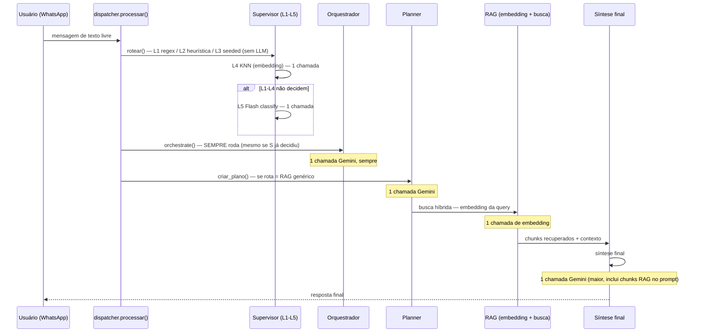
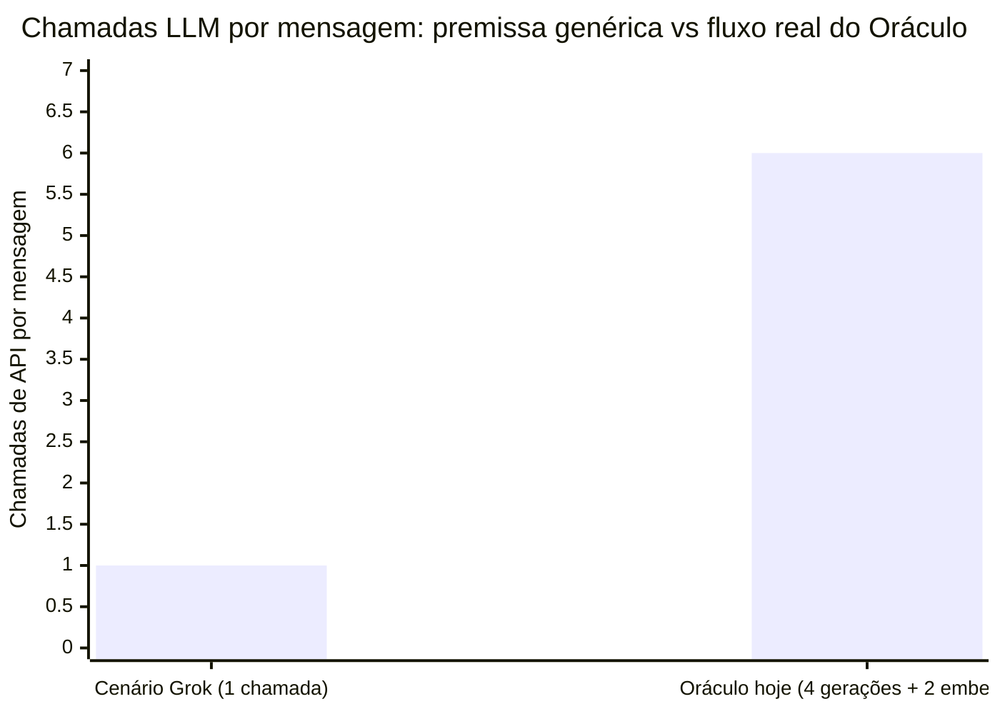

# analise_custo_real_llm.md

> **Status: 🗄️ histórico — gap fechado.** Movido para `docs/historico/` em
> 2026-08-25. A lacuna que este documento identifica (nenhuma telemetria real
> de custo/tokens) foi resolvida na sessão seguinte — ver `notas.md` §13.3
> (`MonitoredLLMProvider` grava em `metricas_llm`/Postgres + Prometheus desde
> então). Mantido como registro do raciocínio que motivou essa mudança.

> Rascunho de discussão, mesmo espírito de `notas_regras_negocio_chunkviz.md`
> e `pesquisa_arquitetura_producao.md`: nada aqui é medição real, é análise
> de engenharia pra sabermos por onde começar a medir de verdade.

## 1. Contexto

O maior receio do usuário hoje não é técnico, é financeiro: não faz sentido
um projeto de agente/multi-agente que custe "10 mil por mês" pra uma
universidade pública. Antes de decidir qualquer otimização, a pergunta certa
é **quanto o Oráculo custaria/custa hoje de verdade** — e a resposta curta,
descoberta nesta investigação, é: **ninguém sabe, porque não existe
instrumentação persistente de custo ligada ao pipeline real** (ver §5).

Foi feita uma pesquisa própria no Grok sobre preços de mercado de soluções
de IA/chatbot em universidades públicas brasileiras. Este documento faz o
que o usuário pediu antes de qualquer orientação de medição: avaliar essa
pesquisa contra o código real do Oráculo, com tabelas e diagramas do nosso
fluxo real.

---

## 2. Avaliação da pesquisa do Grok

### O que é aproveitável

- **Caso UFVJM (Dispensa 90.020/2025, SERPRO/SerproBots)** — ~R$ 104.899
  para 12 meses, documento oficial de ETP. É a referência mais concreta e
  citável que existe pra uma conversa com reitoria/pró-reitoria: mostra que
  uma universidade federal comparável pagou ~R$ 8.740/mês por uma solução
  *comercial completa* (chatbot + WhatsApp oficial + IA gerenciada). Isso é
  um teto de referência de mercado real, não estimativa.
- **Cenários de volume (A-E, 1.000 a 500.000 interações/mês)** — úteis como
  ordem de grandeza de escala, mesmo que os preços de token usados sejam
  genéricos. A ideia de modelar por faixa de volume é a certa.
- **Recomendação de arquitetura híbrida (local + LLM externa seletiva)** —
  bate com o que o Oráculo já faz estruturalmente (RAG/embeddings/reranking
  locais, só a geração final via API paga) — ver `pesquisa_arquitetura_producao.md`
  §2.

### O que é genérico demais pra aplicar direto

A pesquisa do Grok modela custo assumindo **~800–1.500 tokens totais por
interação**, implicitamente uma chamada de LLM por mensagem de usuário. Não
tinha (nem podia ter) acesso ao código real do Oráculo, então não sabia de
dois fatos que mudam a conta de forma material:

1. **Não existe roteamento real de modelo pequeno/grande** — só existe uma
   env var (`settings.GEMINI_MODEL`, default `gemini-2.5-flash`,
   `src/infrastructure/settings.py:41`) usada por **toda** chamada de
   geração de texto do pipeline. `arquitetura_oraculo.md` §4.3 documenta
   uma tabela dizendo "Planner: Pro" / "Synthesis: Pro", mas o código
   (`planning.py:210`, comentário `# gemini-2.5-flash-lite ou pro conforme
   .env`) mostra que é a mesma variável global em todo lugar — **essa
   diferenciação por componente não existe de fato hoje**. (Correção
   registrada aqui: na conversa anterior eu afirmei "model routing já
   existe implicitamente" — essa afirmação vinha só da doc de arquitetura,
   não do código, e estava errada.)
2. **Uma única mensagem de texto livre dispara várias chamadas Gemini**,
   não uma — ver §3 e §4 abaixo.

Conclusão: os cenários de volume do Grok (A-E) continuam úteis como
referência de escala, mas o "tokens por interação" dele precisa ser
multiplicado pelo número real de chamadas por mensagem do Oráculo — que só
dá pra saber lendo o código, não pesquisando o mercado.

---

## 3. Tabela — nosso fluxo real de chamadas Gemini por mensagem

Para uma mensagem de texto livre (sem `!`/`@`/`$`) que cai no fluxo RAG
genérico — o caminho mais comum de uso real:

| # | Etapa | Arquivo/função | Modelo hoje | `max_output_tokens` | Quando dispara |
|---|---|---|---|---|---|
| 1 | Router Supervisor L4 (KNN) | `router/supervisor.py` | embedding (`gemini-embedding-001`) | n/a | Quase sempre, mensagem não-comando |
| 2 | Router Supervisor L5 (Flash) | `llm_fallback.py::_classificar_com_flash` (~linha 90-110) | `GEMINI_MODEL` | 150 | Condicional — quando L1-L4 não decidem com confiança |
| 3 | Orquestrador | `llm_fallback.py::orchestrate()` (~linha 240-260) | `GEMINI_MODEL` | 120 | **Sempre**, pra qualquer mensagem não-comando — mesmo quando o Supervisor já decidiu (bug de precedência documentado em `notas.md` §1) |
| 4 | Planner | `planning.py::criar_plano()` | `GEMINI_MODEL` | 300 | Quando a rota cai no fluxo RAG genérico (não SIGAA/CRUD/ticket) |
| 5 | Embedding da query RAG | `capabilities/rag/retrieval.py` (busca híbrida) | `gemini-embedding-001` | n/a | Toda busca RAG |
| 6 | Síntese final | `agents/academic_knowledge/synthesis.py` | `GEMINI_MODEL` | 512 (default do parâmetro `max_tokens`) | Toda resposta via RAG |

Uma mensagem RAG típica passa por **até 6 chamadas reais à API Gemini** (4
de geração de texto + 2 de embedding), cada uma com seu próprio system
prompt/overhead de input — bem longe da premissa "~1 chamada por interação"
que qualquer pesquisa de mercado genérica assume por padrão.

### Diagrama do fluxo real



---

## 4. Achados críticos de instrumentação — por que não há um número de gasto hoje

A infraestrutura pra medir custo **existe em pedaços**, mas está
desconectada do pipeline real:

| Peça | Status | Onde |
|---|---|---|
| Tabela `metricas_llm` (Postgres) — `tokens_entrada`, `tokens_saida`, `custo_usd`, `modelo`, `rota` | Schema pronto, com índices e queries de dashboard (`get_metricas_dashboard`, `get_metricas_por_rota`) | `migrations/versions/001_observability_tables.py`, `infrastructure/repositories/observability_repository.py` |
| `ObservabilityRepository.salvar_metrica_llm`/`salvar_metrica_sync` | **Nunca chamado em nenhum ponto do pipeline real** — grep confirma zero chamadores fora da própria definição | idem |
| Tabela `monitor_snapshots` — `custo_usd_1h`, `tokens_1h`, `cache_hit_rate` | Schema pronto, nunca populado | `001_observability_tables.py` |
| Prometheus `record_llm_usage()` / `_llm_cost_usd_total` | Só chamado a partir de `application/chain/oracle_chain.bak` — código morto confirmado (chain antiga, substituída pelo Supervisor, `.bak` nunca executa) | `infrastructure/observability/metrics.py` |
| `registrar_tokens_redis()` — **o único que roda de verdade** | Chamado em 3 pontos reais (classify, orchestrate, planner, synthesis) com `usage_metadata` real da API Gemini | `redis_client.py:571`, chamado de `llm_fallback.py` (2x), `planning.py`, `synthesis.py` |
| Mas grava em `eval:tokens:{session_id}` com **TTL de 1 hora** | Comentário no próprio código: *"1 hora de TTL é suficiente para avaliações"* — propositalmente escopado só pro simulador de avaliação do `/hub`, nunca acumulado globalmente nem persistido | `redis_client.py:578` |

**Conclusão**: não é "medimos errado" — é que **não existe onde consultar**
um total de gasto do Oráculo hoje, nem no Postgres, nem no Grafana, nem em
lugar nenhum que sobrevive mais de 1 hora. Os únicos números de custo que
já existem no código aparecem só durante uma sessão de teste manual no
painel admin, e desaparecem depois.

### Achado extra: a única conta de custo que existe no código está desatualizada

`synthesis.py:44-46`:

```python
# Custo Gemini 2.5 Flash (USD por 1M tokens)
_CUSTO_INPUT = 0.075
_CUSTO_OUTPUT = 0.30
```

Preço oficial pesquisado nesta sessão (ver §6) é bem mais alto,
principalmente no output — mesmo essa única conta feita no código estaria
subestimando o custo real por um fator relevante.

---

## 5. Preços reais (pesquisados agora) vs o que o código usa vs o que o Grok assumiu

| Fonte | Input (USD/1M tokens) | Output (USD/1M tokens) | Observação |
|---|---|---|---|
| **Constante no código** (`synthesis.py`) | 0,075 | 0,30 | Desatualizada — parece preço antigo do Gemini 1.5 Flash |
| **Gemini 2.5 Flash — página oficial** ([ai.google.dev/gemini-api/docs/pricing](https://ai.google.dev/gemini-api/docs/pricing)) | ~0,30 | ~2,50 | Fonte oficial primária |
| **Gemini 2.5 Flash — rastreadores de mercado (não oficiais)** | ~0,15 | ~1,25 | Divergem da página oficial — possível preço promocional/tier diferente; **checar a página oficial antes de qualquer número usado em orçamento** |
| **Gemini 2.5 Pro** (até 200K contexto) | ~1,25 | ~10,00 | Sobe pra 2,50/15,00 acima de 200K tokens de contexto |
| **`gemini-embedding-001`** | ~0,15 | n/a | Só input, sem geração |
| **"Mid-tier" genérico do Grok** | 0,10–1,50 | 0,40–9,00 | Faixa ampla, cobre modelos de vários provedores — Gemini Flash cai dentro dela, então os cenários de volume (A-E) continuam válidos como referência de escala |

Não há consenso entre as fontes sobre o preço atual exato do Flash — por
isso qualquer número usado numa apresentação pra reitoria/pró-reitoria
deveria ser conferido direto na página oficial antes, não copiado deste
documento.

---

## 6. Estimativa de custo por mensagem (HIPÓTESE — não é medição)

Combinando a contagem real de chamadas (§3) com os `max_output_tokens`
configurados (valores reais, hard-coded) e uma estimativa de input (não
medida — depende do tamanho do histórico L1, do system prompt e, na
síntese, dos chunks RAG recuperados):

| Etapa | Output máx. (real) | Input estimado (hipótese) | Custo aprox. por chamada (preço oficial Flash) |
|---|---|---|---|
| Supervisor L5 classify | 150 | ~200-400 tokens | < US$0,001 |
| Orquestrador | 120 | ~300-600 tokens | < US$0,001 |
| Planner | 300 | ~500-1.200 tokens | ~US$0,001 |
| Síntese final | 512 | ~2.000-6.000 tokens (inclui chunks RAG) | US$0,002-0,003 |
| 2x embedding (router + RAG) | n/a | pequeno, preço baixo | < US$0,0005 |

**Faixa estimada por mensagem RAG completa: ~US$0,004-0,006** (≈ R$0,02-0,03
no câmbio atual) — isso é uma estimativa de engenharia baseada em limites
configurados de output e input aproximado, **não uma medição real**, porque
não existe telemetria persistente hoje (§4).

### Comparação visual — premissa do Grok vs estimativa real do Oráculo



O custo por token do Gemini Flash está dentro da faixa que o Grok já
considerou — o que ele não podia prever é o **multiplicador de chamadas por
mensagem**, que no Oráculo hoje gira em torno de 4-6x. Isso não significa
necessariamente 4-6x mais caro (cada chamada extra é pequena — classify,
orchestrate e planner têm output baixo), mas explica por que uma estimativa
"ingênua" de custo por interação tende a errar pra menos.

---

## 7. Prévia do próximo passo (não implementado ainda)

A pergunta "quanto estamos gastando de verdade" tem uma resposta de
engenharia relativamente barata: **conectar o que já existe**, não construir
infraestrutura nova.

- Os 3 pontos que já chamam `registrar_tokens_redis()`
  (`llm_fallback.py` x2, `planning.py`, `synthesis.py`) já têm o
  `usage_metadata` real de cada chamada Gemini — tokens de entrada/saída
  reais, não estimados.
- `ObservabilityRepository.salvar_metrica_llm()` já existe, já tem
  dashboard query pronta (`get_metricas_dashboard`, `get_metricas_por_rota`)
  — só não é chamada.
- O trabalho é essencialmente trocar (ou complementar) o destino desses 3
  pontos: em vez de só `eval:tokens:{session_id}` (Redis, TTL 1h), também
  gravar em `metricas_llm` (Postgres, persistente) com o preço por modelo
  atualizado (§5).

Isso fecha o gap descrito em §4 sem inventar ferramenta nova — é a versão
"Fase 2" já prevista em `pesquisa_arquitetura_producao.md` §6, só que agora
com o caminho de implementação concreto identificado. Fica como decisão em
aberto se isso vira a próxima tarefa.

---

## 8. Fontes

- Preços oficiais Gemini API: https://ai.google.dev/gemini-api/docs/pricing
  (checar antes de usar qualquer número em orçamento — divergência
  observada entre esta página e rastreadores de mercado de terceiros, ver
  §5)
- Caso UFVJM (Dispensa 90.020/2025) — citado pelo Grok a partir de
  documento de ETP público; não reverificado nesta sessão (fonte primária
  seria o portal de compras/PROAD da UFVJM ou o PNCP).

---

## 9. Aberto para discussão

- Concordam que a próxima ação concreta é conectar `registrar_tokens_redis`
  → `metricas_llm` (Postgres), em vez de qualquer ferramenta nova?
- Vale medir volume real de mensagens/mês antes de decidir qualquer coisa
  — hoje não há dado de volume real de produção citado em nenhuma nota do
  projeto (ambiente ainda é grupo WhatsApp homologado, não produção plena).
- O bug do Orquestrador que roda "sempre" mesmo quando o Supervisor já
  decidiu (`notas.md` §1) é também um problema de custo, não só de
  arquitetura — cada execução desnecessária é uma chamada Gemini paga à
  toa. Vale priorizar esse fix já pensando em custo, não só em
  corretude.
